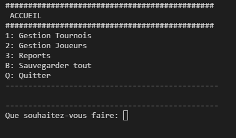

# P4_couignoux_julien

## ChessApp

Application to manage an chess tournament with swiss rules.

-----
> Run the script with the command *python main.py*

## TOURNAMENT

> Manage the tournaments from __1: Gestion Tournois__

> Create a new tournament with  __N: Nouveau tournoi__ and add players

> Or open a tournament with its __id__

> Enter the score with the match id and validate the round with __V: Valider le tour__

The next round is automatly created

## PLAYER

> Manage the players from __2: Gestion Joueurs__

> Create new player with __C: Ajouter Nouveau joueur__ or modify rank with player id 

> Backup players and tournaments with __B: Sauvegarder tout__

## REPORT

> Manage the Report from __3: Reports__

-----
> How to generate a flake8 report

From the root directory, run : 

*flake8 --format=html --htmldir=flake-report*